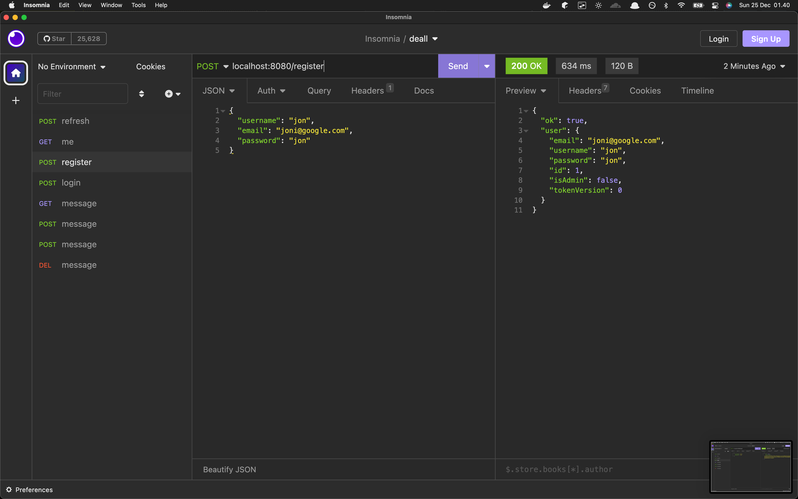
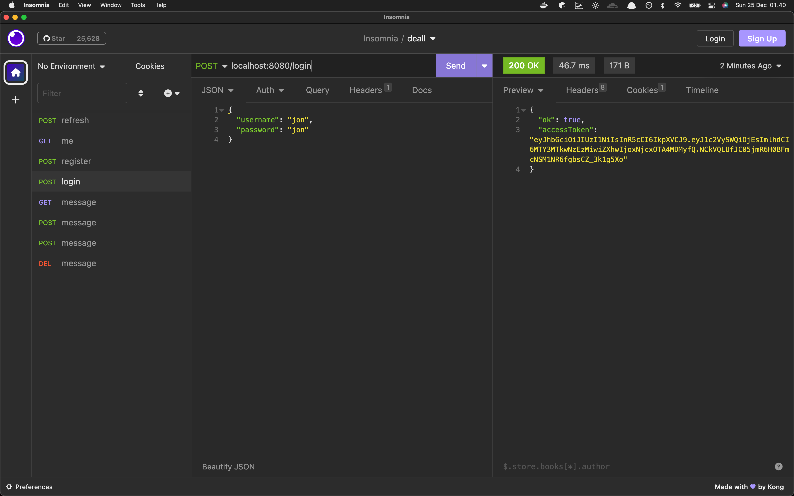
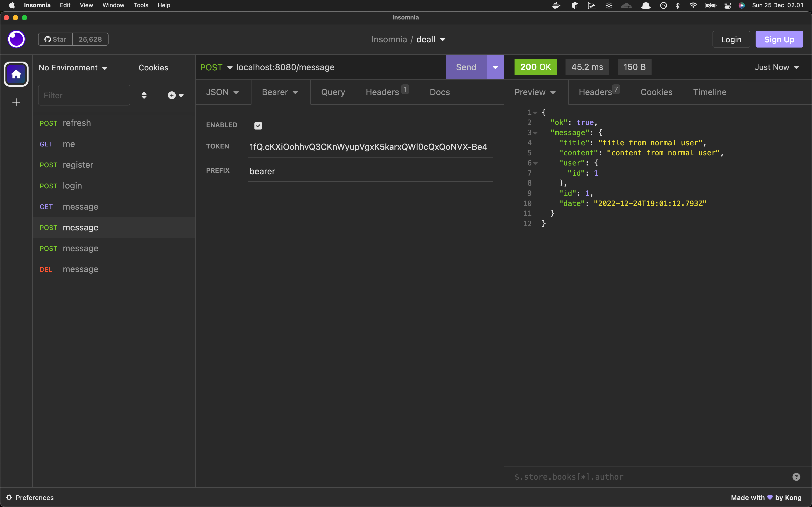
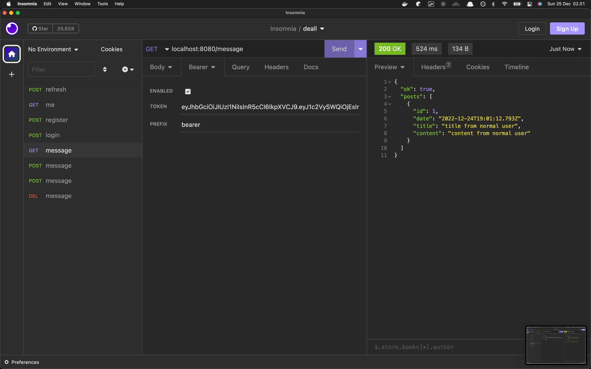
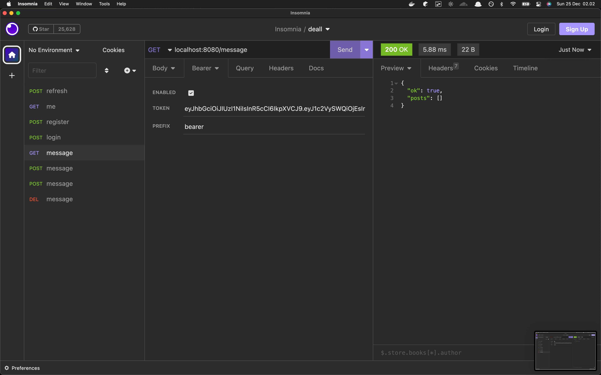

# Deall Backend Assignment

## Start the application

```
kubectl apply -f db.yaml
kubectl apply -f server.yaml
kubectl port-forward service/todo-server-service 8080:80
```

## API Documentation

Import `deall-todo.postman_collection.json` to postman

## Screenshots

register


login & get access token


supply access token to /message


POST message


see that message in GET /message


update POST /message:id


see updated message


DELETE /message:id


confirm deleted

